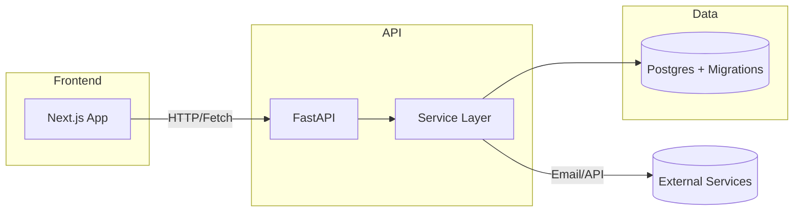

# Portfolio Webpage — Academic Overview

## Abstract

This repository contains a personal portfolio website and accompanying API, designed as a rigorous demonstration of full-stack architecture, software engineering practices, and reproducible deployment. The site showcases projects, technical writing, and an interactive tech radar used for longitudinal analysis of tools and techniques.

## Motivation and Objectives

- Provide a well-documented, reproducible portfolio that demonstrates system design, engineering trade-offs, and research-oriented thinking.
- Serve as a canonical artifact for interviews, academic presentations, and portfolio review.
- Facilitate experimentation with content indexing, embeddings, and lightweight CMS features via the API.

## Repository Structure

- `portfolio-frontend/` — Next.js frontend producing the public website and content pages.
- `portfolio-api/` — FastAPI backend exposing content, profile, links, and radar data; contains DB migrations and services.
- `docs/` — Design documents, architecture notes, and deployment plans.

## Architecture Overview

The system follows a modular, layered architecture with clear separation of concerns:

- Presentation: The Next.js application handles routing, static/SSR rendering, and client UX.
- API Layer: A FastAPI service provides REST endpoints and internal service layers for content, profiles, and search.
- Data: Relational database (SQL migrations included) stores canonical content with RLS and migration history.
- Integrations: Optional embedding, email, and third-party link services are abstracted behind service interfaces.



## Key Design Decisions

- Minimal, testable service interfaces to enable mocking in unit tests.
- SQL-first schema with migrations for reproducibility and auditability.
- Clear separation between content (Markdown/MDX) and presentation templates.
- Progressive enhancement: static generation for canonical pages, dynamic endpoints for interactive features.

## Data Model & Migrations

Migrations are stored under `portfolio-api/migrations/`. The schema emphasizes normalized content tables, tagging, series, and media assets. Reproducibility is maintained by checked-in SQL migrations and seed data.

## Security & Privacy

- Uses principle of least privilege for API operations and minimal public surface for write operations.
- Email and external integration credentials must be provided via environment variables and never committed.

## Testing and Quality Assurance

- `tests/` under `portfolio-api/` contains pytest-style tests for health, contact, and rate limiting.
- CI should run linting, type-checking (`pyright`), and the test suite before merging.

## Deployment

- The repository includes a `Dockerfile` (under `portfolio-api/`) and a `render.yaml` for deploys. Example steps:

```bash
# Build and run locally (API)
cd portfolio-api
docker build -t portfolio-api .
docker run -e DATABASE_URL="$DATABASE_URL" -p 8000:8000 portfolio-api
```

Deployment targets and scripts are discussed in `docs/DEPLOYMENT_ARCHITECTURE.md`.

## Reproducibility & Evaluation

- All environment configuration should be captured in `.env` files (excluded from VCS) and deployment manifests.
- To reproduce the production database schema, apply the checked-in SQL migrations in order.

## Roadmap and Future Work

- Add full-text search with embeddings and configurable retrievers.
- Expand automated tests and integrate E2E tests for the frontend.
- Add an experimentation/analytics pipeline to evaluate content engagement.

## How to Contribute

Contributions are welcome. Preferred workflow:

1. Fork the repository.
2. Create a feature branch for changes.
3. Open a pull request with tests and a clear description.

## Citation

If you reference this project in academic work, cite the repository and include a short note about its purpose and the commit SHA used.

## Contact

Project maintainer: see `docs/` and the `portfolio-api` contact endpoints.

---
_This README is intentionally formal and structured for academic presentation and reproducibility._
